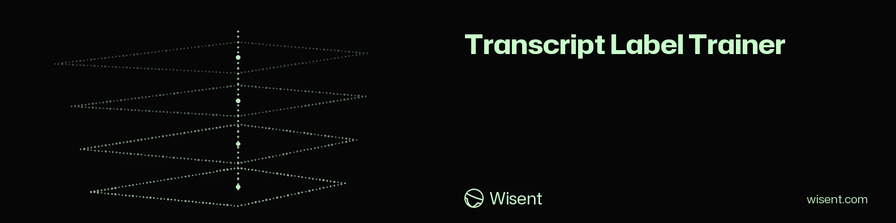

<!-- wisent-banner:start -->
<p align="center">
  
</p>
<!-- wisent-banner:end -->

<!-- wisent-readme-signals:start -->
[](https://github.com/wisent-ai/transcript-label-trainer) [](https://github.com/wisent-ai/transcript-label-trainer/issues) [](https://wisent.ai) [](https://discord.gg/qRjpkthq54) [](https://www.linkedin.com/company/wisent-ai/) [](https://x.com/wisentai) [](https://calendly.com/lbartoszcze)
<!-- wisent-readme-signals:end -->

# Transcript Label Trainer

**Transcript Label Trainer trains small local classifiers that predict aspect
labels for coding-agent sessions in the Transcript Lake, and emits label
suggestions — it never writes to the lake.**

The lake's labeler owns an append-only store of aspect labels at
`~/.transcript-lake/labels/*.ndjson`, one record per aspect label on a session:

```json
{"ts": "...", "session_id": "...", "runtime": "...", "aspect": "topic", "value": "...", "note": "...", "source": "manual"}
```

Aspects are independent dimensions ("kąty"): topic, quality, reviewed,
task-type — many per session. This repository turns the manual labels into a
model that suggests the rest.

## Product boundary

Transcript Label Trainer owns:

- training one classifier per aspect over the manual labels in the lake's
  label store — TF-IDF + logistic regression by default, or a fine-tuned
  HuggingFace transformer when `--model` is given (optional `hf` feature);
- session-text reconstruction, by shelling out to the lake CLI's read-only
  `query` command (user + assistant text per session, ordered by `ts`, capped
  at 12 KB);
- emitting suggestion records shaped exactly like label-store records, with
  `source="model"` and the confidence in `note`;
- its own model artifacts, under the training root Stado places this trainer
  on — runtime state, outside this repository (see *Placement*), including the
  frozen evaluation split (`eval-split.json`) and the teacher's verdict
  (`judge.json`);

Transcript Label Trainer does not own:

- the lake, its ingest, its events, or its views — that is
  [`wisent-ai/transcript-lake`](https://github.com/wisent-ai/transcript-lake),
  consumed here read-only through its own CLI;
- the label store or the label vocabulary — the lake's labeler owns
  `labels/*.ndjson`; this tool reads it and never writes it;
- applying `infer` suggestions. Review the emitted records, then apply them
  through the lake's labeler: `transcript-lake label add <session-id> --aspect
  <name> --value <v> --source model`. (`autolabel` is the deliberate
  exception: it writes through the lake CLI without a human staging queue and
  can require the independent Brama `-best` gate.);
- model serving, the compute-target registry, or remote job lifecycle. Stado
  owns placement, source checkout, scoped secrets, execution, logs, and the
  terminal outcome; this trainer only prepares and submits the declared work.

## Quick start

```sh
cargo install --path .
```

`cargo install` places `transcript-label-trainer` in `~/.cargo/bin`, which must
be on `PATH`. To build without installing, run `cargo build --release` and
invoke `target/release/transcript-label-trainer` directly. Building needs a
Rust toolchain at version `1.85` or newer; nothing else.

Train one aspect from the manual labels in the lake:

```sh
transcript-label-trainer train --aspect reviewed
```

With too few labeled sessions this fails cleanly, stating the minimum and the
actual count — that is correct behavior, not a crash. The minimum is 8 labeled
sessions across at least 2 distinct values *on the training side*: a fifth of
the labels is frozen out of training by default, so in practice about 10
labeled sessions get you started. `--no-eval-split` trains on all of them.

Emit suggestions for sessions that have no label on that aspect yet:

```sh
transcript-label-trainer infer --aspect reviewed --limit 20
```

Each suggestion is a label-store-shaped record with `source="model"`:

```json
{
  "ts": "2026-08-08T05:00:00Z",
  "session_id": "abc123",
  "runtime": "claude",
  "aspect": "reviewed",
  "value": "yes",
  "note": "confidence=0.83",
  "source": "model"
}
```

Suggestions are printed to stdout and nothing is written to the lake. To apply
them, review and feed the accepted ones to the lake's labeler:

```sh
transcript-label-trainer infer --aspect reviewed --limit 20 > suggestions.json
# review, then apply each accepted record:
transcript-lake label add <session-id> --aspect reviewed --value <value> --source model --note "confidence=0.83"
```

Inspect trained aspects, artifact paths, and metrics:

```sh
transcript-label-trainer info
```

## Fine-tuning a HuggingFace model

By default `train` fits TF-IDF + logistic regression. With `--model` it
fine-tunes a HuggingFace sequence-classification model instead. This needs
the optional `hf` feature (candle-core, candle-nn, tokenizers, hf-hub);
without it, `train --model` fails with a message telling you to build it in:

```sh
cargo build --release --features hf
```

Use `cargo install --path . --features hf` instead to replace the installed
binary. Fine-tuning supports the `distilbert` and `bert` architectures, which
covers `distilbert-base-multilingual-cased` and `bert-base-multilingual-cased`;
any other `model_type` fails with a sentence naming those two rather than
pretending to train.

Transcripts are mixed Polish and English, so prefer a multilingual base model:

```sh
transcript-label-trainer train --aspect topic \
  --model distilbert-base-multilingual-cased \
  --epochs 3 --batch-size 8 --lr 2e-5 --max-length 512
```

The data path is identical: labels from the lake label store, session text via
applies, and the HF path additionally requires at least 2 sessions per class so
its in-training split keeps every class on both sides; that split is a
stratified slice of the *training* side and provides `in_training_eval` in the
metrics. It is not the frozen evaluation split described below, which no
backend ever trains on and which both backends score under
`holdout_evaluation`.

Artifacts land in `<training root>/models/<aspect>/hf-<sanitized-model-id>/` —
`model.safetensors` (the fine-tuned encoder plus classification head),
`config.json` (the base model's config carrying `num_labels`, `id2label`, and
`label2id` for the classes this aspect learned) and `tokenizer.json`, plus a
`metrics.json` with the same fields as the sklearn metrics (aspect, counts,
classes, n_sessions, …) plus the hyperparameters, base model, device, and both
evaluations. Training uses Apple-silicon Metal automatically and CPU
everywhere else, the way the Python backend used MPS: `Cargo.toml` turns
candle's `metal` feature on for macOS only. `metrics.json` records which one
ran under `device`, as `metal` or `cpu`; the Python build wrote `mps` there.

When both a sklearn and an HF artifact exist for an aspect, `infer` uses the
newest one by training time; `info` lists every backend per aspect and marks
the active one.

## Training jobs

For repeatable runs, declare the job in a YAML spec instead of flags. A job
answers four questions: **WHO** evaluated the transcripts (`evaluator` — the
exact label-store source that counts as ground truth; only labels with exactly
this source are used), **WHICH** model to train (`model` — `tfidf-logreg` for
the sklearn backend, any other string is a HuggingFace model id), the **SCOPE**
of training data (`scope`), and the **TASK** (`task` — free text stored with
the artifacts and shown by `info`).

```yaml
name: topic-v1
task: classify the primary topic of the session
evaluator: manual
model: tfidf-logreg
scope:
  aspect: topic
  runtimes: [claude, codex, kimi]  # optional; default is all runtimes
  since: "2026-07-01"              # optional; label ts must be on/after this
  values: [bugfix, feature, chore] # optional; restrict to these values
  min_text_chars: 200              # optional; skip shorter session texts
eval_split:                        # optional; ON by default, shown with its defaults
  fraction: 0.2                    # share of labeled sessions frozen out of training
  seed: 20260808                   # fixed, so the first run's pick is reproducible
judge:                             # optional; ON by default, shown with its default
  model: codex/gpt-5.6-sol         # the Brama-routed teacher `evaluate` asks
```

Every field is validated with a clear error — there are no silent defaults.
Note that `evaluator: manual` matches only `manual` exactly, not `human` or
`brama:…`; to train on a teacher's labels, name it, e.g.
`evaluator: brama:claude-opus-4.6`. Model-sourced labels are never ground
truth unless you explicitly say so, because self-training on the model's own
predictions is a confirmation loop.

```sh
transcript-label-trainer run jobs/example-topic.yaml
```

`run` prints a resolved summary (name, task, evaluator, model, scope, and the
sessions found per class), then the resolved evaluation split (how many
sessions train, how many are held out, and whether the frozen file was reused),
and only then trains. Artifacts land in `<training root>/models/<name>/` with a
copy of the spec (`job.yaml`), and `metrics.json` carries the job metadata.
`train` and `infer` are unchanged; `run` is a layer over the same code path.

## The frozen evaluation split, and a Brama judge on top of it

Comparing two models over time only means something when both were scored on
the same untouched sessions. So every job and every `train` freezes a holdout
**by default** — you have to say `eval_split: false` to train on everything —
and the chosen session ids are written once to
`<training root>/models/<name>/eval-split.json`:

```json
{
  "fraction": 0.2,
  "seed": 20260808,
  "created_at": "2026-08-08T22:14:07Z",
  "session_ids": ["019f3a44-…", "session_95aaaf37-…"]
}
```

What "frozen" buys you, and what it costs:

- **Written once, reused forever.** Every later run of the same job reads that
  file back and never rewrites it. Sessions labeled after the first run can
  only join the *training* side — nothing is ever promoted into the holdout —
  and a session in the holdout is never trained on, by either backend.
- **Reproducible from the seed.** The first run picks the holdout stratified
  per class, shuffled by `seed` (and the class name, so labeling one class more
  does not reshuffle the others). No class is ever emptied into the holdout,
  and any class with two or more sessions contributes at least one.
- **It costs training data.** The floor of 8 sessions and 2 distinct values now
  applies to the *training* side, so about 10 labeled sessions is the practical
  minimum. Too few and the run fails with the exact numbers and says how to
  disable the split.
- **If the spec's fraction or seed later disagrees with the file, the file
  wins** and the run says so on stderr. That is what frozen means; delete the
  file by hand if you truly want a different holdout, and accept that the
  comparison with older runs is gone.

Both backends report it in `metrics.json` under `holdout_evaluation` —
accuracy, per-class counts, correct-per-class, and the confusion pairs — kept
deliberately separate from the HF backend's `in_training_eval`, which is a
stratified slice of the training side and is resplit on every run.

Accuracy against a stored label says how often the model agreed with whoever
labeled the session. It does not say whether the label the model chose was
defensible. `evaluate` asks that second question of a Brama teacher:

```sh
transcript-label-trainer evaluate topic-v1 --best
```

```
topic-v1 (aspect: topic, backend: sklearn):
    frozen split:  5 session(s), fraction=0.2, seed=20260808, created 2026-08-08T22:14:07Z
    split file:    /…/models/topic-v1/eval-split.json
    holdout:       accuracy=0.6 on 5 session(s)
        agent: 3/3 correct
        data: 0/1 correct
        confused data -> agent (1x)
    judge:         <model> calls 4/5 prediction(s) acceptable (agreement_rate=0.8, failed=0)
```

Per holdout session the judge gets the reconstructed session text (the same
lake CLI path and the same 12 KB cap training uses), the model's prediction and
the ground-truth label, and answers `acceptable` or `unacceptable` — so a
prediction that differs from the label can still be ruled defensible, and a
prediction that matches it can still be rejected. The verdict, the aggregate
agreement rate and one record per session go to
`<training root>/models/<name>/judge.json`.

`--best` adds a second, independent pass through Brama's `-best` subscription
route. For every holdout record it audits both the stored ground-truth label
and the first judge's `acceptable`/`unacceptable` opinion against the
transcript. The four possible outcomes (`both-sensible`, `label-nonsensical`,
`judge-nonsensical`, `both-nonsensical`) and their aggregate counts are stored
under `best_review` in the same `judge.json`; any nonsensical or unreviewed
record makes the command exit nonzero.

Rules, mirroring `autolabel`:

- **Failure isolation.** A Brama error or an unparseable answer fails that one
  session, is counted in `failed`, and is recorded verbatim in `judge.json`.
- **No invented verdict.** If not one session could be judged — no usable
  provider route, no credential — `evaluate` prints the gateway's own error
  verbatim, writes nothing, and exits nonzero. There is no local heuristic
  fallback, because a fabricated verdict is worse than no verdict.
- The judge model comes from the job spec's `judge.model`, or `--brama-model`,
  defaulting to the same teacher `autolabel` uses. `judge: false` in the spec,
  or `--no-judge`, reports the holdout scores alone.
- Auth is `brama.rs`'s single HMAC/Skarbiec path — the same one `autolabel`
  uses. There is no second credential route.

`train` takes the same split as flags: `--eval-split-fraction`,
`--eval-split-seed`, `--no-eval-split`. `evaluate <aspect>` then scores it the
same way.

## Automatic labeling with a Brama teacher

`autolabel` labels sessions at scale with a model routed through Brama —
Wisent's authenticated, provider-neutral OpenAI-compatible gateway (all LLM
inference goes through Brama; never direct provider keys). With `--best`, each
proposed label is independently audited by Brama's `-best` route before it can
reach Transcript Lake; there is still no human staging queue.

```sh
transcript-label-trainer autolabel --aspect tasktype \
  --values bugfix,feature,chore,question --limit 50 --best
```

For each session that has no label on the aspect yet, autolabel reconstructs
the session text and asks the teacher for exactly one of the allowed values.
With `--best`, a second model returns `sensible` or `nonsensical`; only a
`sensible` proposal is applied through the lake's own CLI:

```sh
transcript-lake label add <session-id> --aspect tasktype --value <v> --source brama:<model-id> --note "autolabel; reviewed=-best"
```

The lake CLI validates the session and owns the write — that boundary stays;
what changed is only that no human reviews the suggestion. Rules:

- **No overwrite.** A session already labeled with the aspect by ANY source
  is skipped — human labels are sacred, and reruns are idempotent.
- **Semantic gate.** `--best` never applies a proposal rejected as
  `nonsensical`, records it under `rejected`, and exits nonzero if a proposal
  is rejected or the final reviewer cannot answer.
- **Failure isolation.** A Brama error or an unparseable answer fails that
  one session, writes nothing for it, and is counted in the final summary
  (`labeled` / `skipped_labeled` / `failed`).
- The teacher defaults to `codex/gpt-5.6-sol` — one of the few model ids this
  fleet's Brama can actually serve, and multilingual, which the mixed
  Polish/English transcripts need; override with `--brama-model`.
- Auth mirrors jeden: HMAC-signed requests keyed by the Skarbiec item
  `agent:wisent-app`, bearer from `jeden-model-router`, endpoint from
  `BRAMA_URL` (falling back to jeden's own configured URL). Secrets are read
  into memory only, never printed.

The end-to-end story: autolabel an aspect, then train on the teacher's
labels by naming the provenance in a job spec:

```yaml
name: tasktype-v1
task: classify what kind of work the session did
evaluator: brama:codex/gpt-5.6-sol
model: tfidf-logreg
scope:
  aspect: tasktype
```

## Reviewed Jeden goal model

`goal-model` owns the complete small-model pipeline that turns coding-agent
messages into the 3–7 word task goals Jeden displays. It reads messages only
from Transcript Lake's normalized `events` view; raw agent session files are
not an input, so the lake's masking boundary remains intact.

```sh
transcript-label-trainer goal-model \
  --compute-target ubuntu-server-rtx-pro-6000 \
  --limit 1500
```

The command reviews existing Omp titles and Brama-teacher goals through the
independent `-best` route before either enters the dataset. It then submits the
reviewed JSONL and the exact trainer commit to the named Stado target as an
exclusive full-finetune, using the pinned
`Qwen/Qwen3-0.6B@c1899de289a04d12100db370d81485cdf75e47ca` base. Held-out Omp
title pairs never enter training. Every student prediction over that holdout
must receive `both-sensible` from a final `-best` audit or the job fails before
export.

A successful job publishes F16 and Q8_0 GGUF files, metrics, held-out
predictions, the full final audit, the canonical prompt, dependency lock, and
checksums under the content-addressed URI printed as `model artifact:
stado://probierz/artifacts/models/jeden/goal-qwen3-0.6b/<dataset-sha256>`.
Stado also retains its canonical `status/<job-id>/output/` copy. All model calls
use `brama.rs`; the pipeline has no direct provider credentials or second auth
implementation.

## Placement: Stado decides where this runs

Stado owns the canonical compute-target registry, and that registry — not this
repository and not an environment variable — is the authority on where label
models are trained and where the lake keeps its data. Two declarations carry
it, both per registry target:

| Key | Meaning |
|---|---|
| `targets[<this machine>].transcript_lake.root` | the **storage root**: the lake data root labels and session text are read out of |
| `targets[<host>].training` | `{enabled, kinds, models_dir}` — the host that trains, and the **training root** for model artifacts on it. This trainer claims the kind `label-model`. |

Register both through the checked-in script, never by hand:

```sh
./scripts/register-placement.sh
```

It pulls the canonical document, merges the two declarations into it, and
pushes only if the merge changed something — so a second run leaves the
registry byte-identical, and no key another publisher added is ever dropped.
`TRAINING_HOST`, `TRAINING_ROOT` and `LAKE_DATA` override what it declares;
the machine it declares the lake root for is whatever `stado registry self`
says this box is.

### Execute on one named compute target

`run --compute-target` turns the local command into a Stado job pinned to one
canonical registry target:

```sh
transcript-label-trainer run jobs/example-topic.yaml \
  --compute-target ubuntu-server-rtx-pro-6000
```

The submitter resolves the job against the local Transcript Lake, exports only
the selected labels and their capped transcript text, and uploads that
read-only, content-addressed bundle plus the validated YAML through Probierz's
`inputs/transcript-label-trainer/` object boundary. Stado then clones this
repository at one exact commit, pins the job with `--pinned-host`, injects the
Brama signing and bearer references through `--secret-env`, and streams
`stado job watch --follow`
until the target reports a terminal state. The remote command trains under the
target's declared `training.models_dir`; when the default split and judge are
enabled, it immediately runs `evaluate <name> --best`, so nonsensical labels
or final judge opinions fail the Stado job rather than becoming a successful
artifact.

### Resolution order

Each root is resolved independently, strongest layer first:

1. **flag** — `--training-root` / `--storage-root`, before the subcommand;
2. **env** — `TLT_HOME` / `LAKE_DATA`;
3. **stado** — the declarations above;
4. **local-fallback** — `~/.transcript-label-trainer` and `~/.transcript-lake`.

### The local fallback is an exception, not a default

Falling back is never silent. `info` prints the resolved placement, and
`source` reports the *weakest* layer any root needed, so one root quietly
going local cannot hide behind another that resolved:

```
placement:
    source:        local-fallback
    training host: ubuntu-server-rtx-pro-6000
    training root: /Users/lukaszbartoszcze/.transcript-label-trainer
    storage root:  /Users/lukaszbartoszcze/.transcript-lake
    fallback:      training root … — local fallback because Stado places
                   label-model training on ubuntu-server-rtx-pro-6000 at
                   /mnt/wd16tb/stado/training, and this machine is
                   lukasz-macbook; storage root … declared in the Stado registry
```

Everything that can stop Stado from answering degrades this way and names
itself in the `fallback` line: the `stado` binary absent from `PATH`, the
registry unreachable, this machine not declaring `transcript_lake.root`, no
host declaring the `label-model` training kind, or — as above — training
placed on a host that is not the one running the command. Resolution never
raises; a control plane that is down must not stop a local run, only stop
being invisible about it.

`info --json` carries the same thing under `placement`, next to `aspects`.

## Environment

- `TLT_HOME` — trainer state root. Overrides the Stado training declaration;
  models live under `$TLT_HOME/models/<aspect>/` (tfidf-logreg as `model.json` +
  `metrics.json`, HF fine-tunes in `hf-<model-id>/` subdirectories, plus the
  job's `eval-split.json` and, once `evaluate` has run, `judge.json`).
- `LAKE_DATA` — lake data root. Overrides the Stado storage declaration, and
  is passed through to the lake CLI.
- `TLT_LAKE_CLI` — override how the lake CLI is invoked, split on whitespace
  into a command and its arguments. Default: `transcript-lake` on `PATH`,
  falling back to
  `~/Documents/CodingProjects/Wisent/transcript-lake/target/release/transcript-lake`
  when the name is not found there.
- `TLT_DATASET_BUNDLE` — internal read-only dataset bundle used by a pinned
  Stado job instead of reaching back into the source machine's lake.
- `TLT_REPO_REF` — exact lowercase commit used for Stado's source checkout;
  normally resolved from this checkout automatically.

## Requirements

- A Rust toolchain at version `1.85` or newer, to build the binary. The
  tfidf-logreg backend needs nothing else at run time.
- The `hf` cargo feature, for `--model` fine-tuning.
- The lake CLI and DuckDB, because session text comes from the lake CLI's
  `query` command, which runs DuckDB over the lake's own views.

## Unreleased changes

- `run JOB --compute-target TARGET` now exports a minimal read-only dataset,
  submits the exact trainer commit through Stado, pins execution to the named
  compute target, follows the job, and runs the semantic evaluation there.
- `autolabel --best` audits proposed labels before writing them;
  `evaluate --best` independently audits both stored labels and the first
  judge's opinions through Brama's `-best` route. Both are quality gates with
  machine-readable records and nonzero status for nonsensical results.

- Transcript Label Trainer is now implemented in Rust and ships as one binary.
  Existing command behavior remains compatible; the Stado and `--best`
  surfaces above are additive. Existing label records, `metrics.json`
  (including the `backend` value, still literally `sklearn` for the
  tfidf-logreg artifact), `eval-split.json`, `job.yaml`, and the job spec YAML
  keep their shapes; `--best` adds its audit records only to command output and
  `judge.json`. One file changed name during the Rust migration: `model.json`
  replaces `model.joblib`, because the fitted vectorizer and classifier are now
  stored as JSON anything can read.
- **Retrain any model the Python build produced.** A `model.joblib` is a
  pickle this binary cannot read. `info` still lists such an artifact with all
  its metrics; only inference refuses, saying the artifact "holds
  model.joblib, a pickle written by the Python build that this binary cannot
  read" and naming the `train`/`run` command that produces `model.json`. The
  labels it was trained on are untouched in the lake, so retraining is the
  whole migration.
- Installation changed: `cargo install --path .` replaces the virtualenv and
  `pip install -e .`. The HuggingFace fine-tune backend is the `hf` cargo
  feature (`cargo install --path . --features hf`), built on candle and
  tokenizers rather than torch and transformers.
- Python, pip, a virtualenv, scikit-learn and PyYAML are no longer
  prerequisites, and neither is Node: the lake CLI this tool shells out to is a
  Rust binary now, so `TLT_LAKE_CLI` defaults to `transcript-lake` on `PATH`.
  DuckDB is still required, because session text still comes from the lake
  CLI's `query` command.